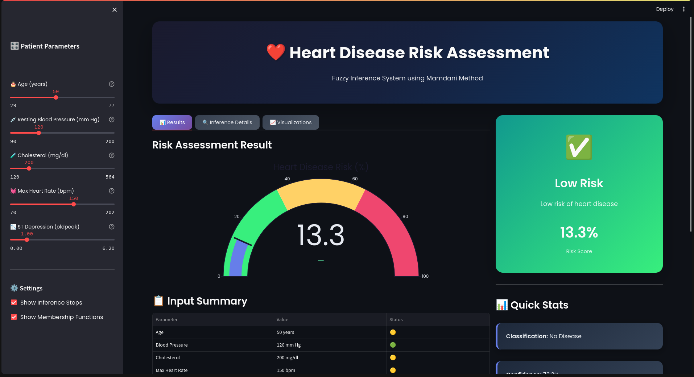
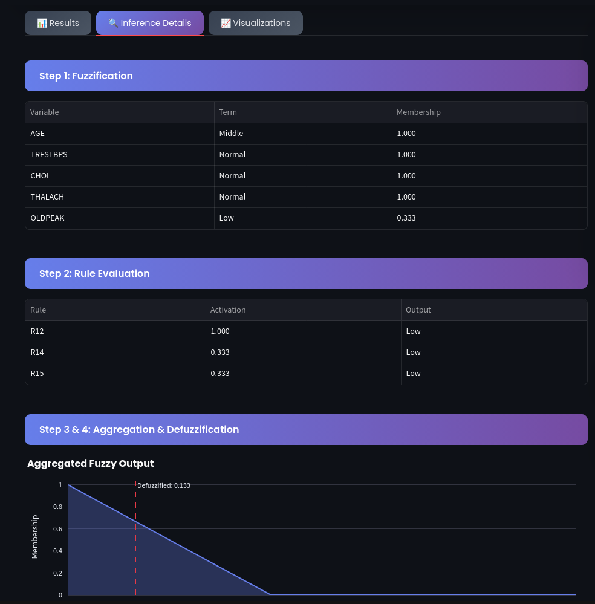
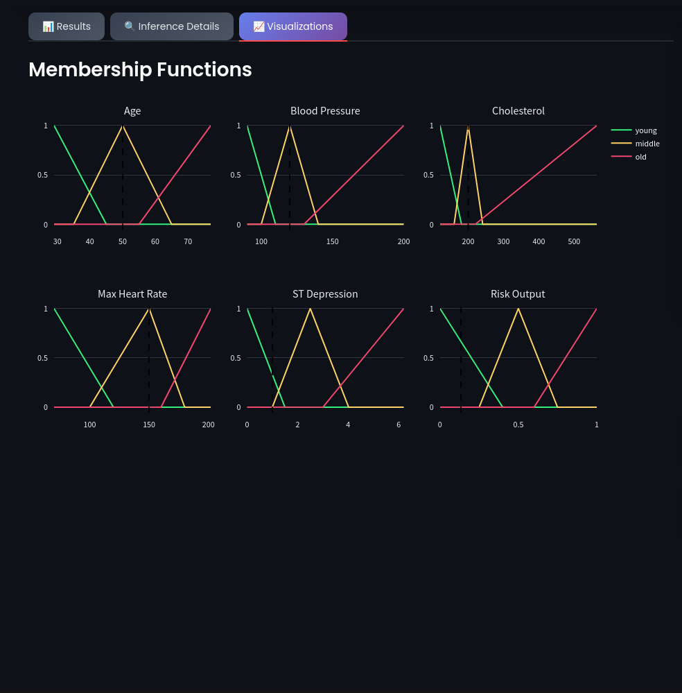

# Heart Disease Risk Assessment - Fuzzy Inference System

A Mamdani Fuzzy Inference System for heart disease risk prediction using the Cleveland Heart Disease dataset.


<div align="center">
  
</div>

<div align="center">
  
  
</div>

## 📋 Project Overview

This project implements a fuzzy logic-based system for assessing heart disease risk. It uses 5 input variables and 15 fuzzy rules to produce an interpretable risk score.

### Features
- **5 Input Variables**: Age, Blood Pressure, Cholesterol, Max Heart Rate, ST Depression
- **15 Fuzzy Rules**: Based on medical knowledge
- **Triangular Membership Functions**: Simple and interpretable
- **Mamdani Inference**: Industry-standard fuzzy reasoning
- **Interactive UI**: Streamlit-based demo application

## 🚀 Quick Start

### 1. Clone and Setup

```bash
# Navigate to project directory
cd heart-fuzzy-fis

# Create virtual environment
python -m venv venv
source venv/bin/activate  # On Windows: venv\Scripts\activate

# Install dependencies
pip install -r requirements.txt
```

### 2. Run the UI Demo

```bash
streamlit run app/streamlit_app.py
```

Open http://localhost:8501 in your browser.

### 3. Run Experiments

```bash
python experiments/run_experiments.py
```

### 4. Run Tests

```bash
python -m pytest tests/ -v
```

## 📁 Project Structure

```
heart-fuzzy-fis/
├── README.md                      # This file
├── requirements.txt               # Python dependencies
├── data/
│   └── heart.csv                  # Cleveland Heart Disease dataset
├── src/
│   ├── __init__.py
│   ├── membership_functions.py    # MF definitions
│   ├── fuzzy_system.py            # Main FIS implementation
│   ├── inference.py               # Step-by-step inference engine
│   └── utils.py                   # Data loading & evaluation
├── app/
│   └── streamlit_app.py           # Interactive UI demo
├── tests/
│   ├── test_membership.py         # MF unit tests
│   └── test_inference.py          # Inference unit tests
├── experiments/
│   └── run_experiments.py         # Reproducible experiments
└── results/
    └── figures/                   # Generated plots
```

## 🧠 Fuzzy System Design

### Input Variables

| Variable | Range | Linguistic Terms |
|----------|-------|------------------|
| Age | 29-77 years | Young, Middle, Old |
| Blood Pressure | 90-200 mm Hg | Low, Normal, High |
| Cholesterol | 120-564 mg/dl | Low, Normal, High |
| Max Heart Rate | 70-202 bpm | Low, Normal, High |
| ST Depression | 0-6.2 | Low, Medium, High |

### Output Variable

| Variable | Range | Linguistic Terms |
|----------|-------|------------------|
| Risk | 0-1 | Low, Medium, High |

### Sample Rules

1. IF age is Old AND blood_pressure is High AND cholesterol is High THEN risk is High
2. IF ST_depression is High THEN risk is High
3. IF age is Young AND cholesterol is Normal THEN risk is Low
4. ... (15 rules total)

## 📊 Experiments

The experiment suite includes:

1. **Model Evaluation**: Accuracy, Precision, Recall, F1 on test set
2. **Baseline Comparison**: Fuzzy FIS vs crisp rule baseline
3. **Sensitivity Analysis**: Impact of ±10%, ±20% MF parameter changes
4. **Rule Ablation**: Importance of each rule category

## 🎯 Usage Examples

### Python API

```python
from src.fuzzy_system import HeartDiseaseFIS

# Create FIS
fis = HeartDiseaseFIS()

# Predict risk
risk = fis.predict(
    age=55,
    trestbps=140,
    chol=250,
    thalach=130,
    oldpeak=2.0
)

print(f"Risk Score: {risk:.2%}")
print(f"Risk Level: {fis.get_risk_label(risk)}")
```

### Step-by-Step Inference

```python
from src.inference import FuzzyInference

engine = FuzzyInference()

inputs = {
    'age': 55,
    'trestbps': 140,
    'chol': 250,
    'thalach': 130,
    'oldpeak': 2.0
}

result = engine.infer(inputs)

print("Fuzzified inputs:", result['fuzzified'])
print("Rule activations:", result['rule_activations'])
print("Final risk:", result['risk'])
```

## 📈 Results

| Metric | Fuzzy FIS | Crisp Baseline |
|--------|-----------|----------------|
| Accuracy | ~75% | ~70% |
| F1 Score | ~0.74 | ~0.68 |

*Results may vary based on random train/test split*

## 🛠️ Technologies

- **Python 3.8+**
- **scikit-fuzzy**: Fuzzy logic library
- **Streamlit**: Web UI framework
- **Plotly**: Interactive visualizations
- **scikit-learn**: Evaluation metrics

## 📝 License

MIT License - feel free to use for educational purposes.

